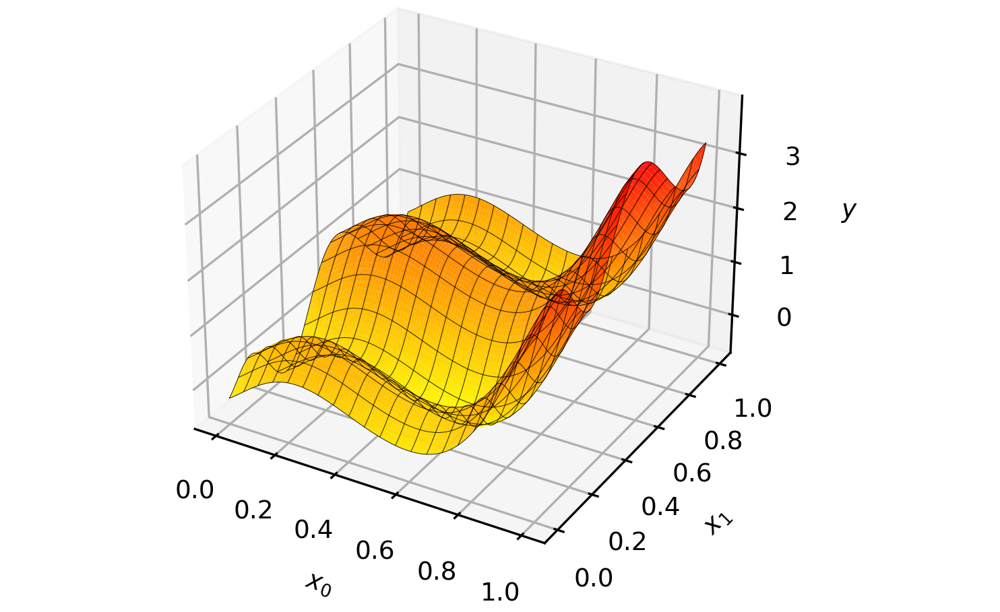
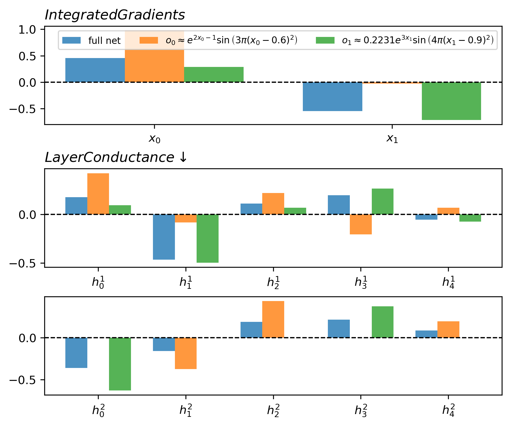

## Discovering Symbolic Pathways in Neural Networks
*April 09, 2023*  
&nbsp;  
&nbsp;  

[PySR](https://github.com/MilesCranmer/PySR) uses evolutionary algorithms to search for symbolic expressions which optimize a particular objective.

- Are functions or constraints related to the data learned by specific neurons or connections in the network?
- Look more at layer/neuron conductance to derive importance of a layer's units to the output of a network. To get the output that approximates some function, say, $cos(x_2)$ we can zero out the weights in the output layer that do not contribute to this approximation.  Further more, the input attributions can be found with a method like Integrated Gradients, which would be good to see in combination with layer conductance for every equation found with symbolic regression. Captum has Layer/Neuron Conductance methods.
- There may be a method with layer-wise relevance propagation that would allow a traceback from output to input with attribution through every layer and neuron.
- based on the results of neuron importance, can we prune the network with equation replacement?

#### Limitations
- Still need to find an appropriate application where constrains are learned.
- Only applicable to fully-connected networks and not convolutional layers yet.

|  | 
|:--:| 
| **Figure 1**: Example function, $f(x_0, x_1) = 0.2231 e^{3 x_{1}} \sin \left(4 \pi \left(x_{1} - 0.9\right)^{2} \right) + e^{2 x_{0} - 1} \sin \left(3 \pi \left(x_{0} - 0.6\right)^{2} \right)$. |
&nbsp; 

|  | 
|:--:| 
| **Figure 1**: Example function |
&nbsp; 