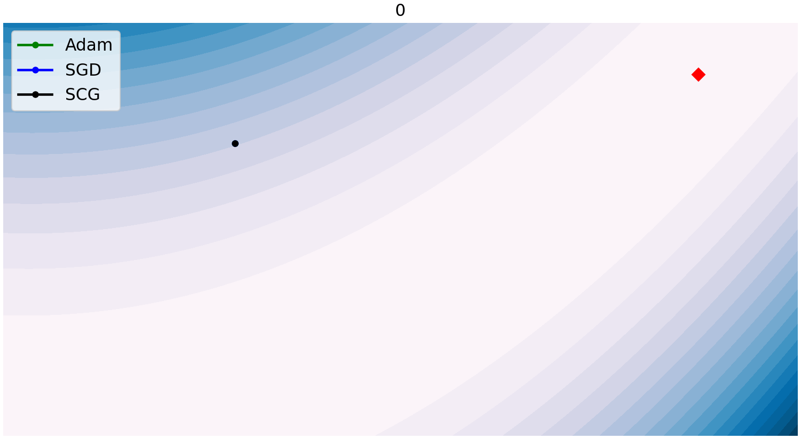
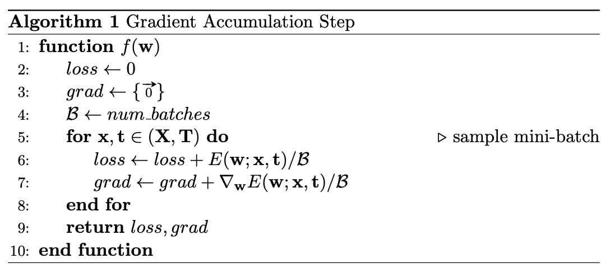
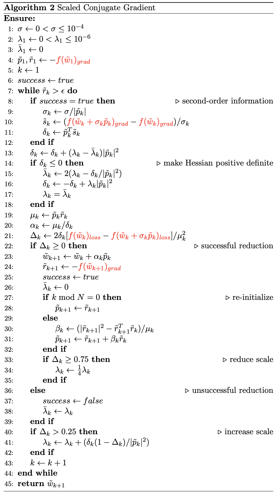

## Minibatched Scaled Conjugate Gradient with Gradient Accumulation
*Sep 23, 2022*  
&nbsp;  
&nbsp;  

Scaled Conjugate Gradient (SCG) is an effective full-batch learning algorithms when trained on data that can fit in memory. ImageNet, however, is too large for full-batch optimization, but could we use a large enough batch (e.g. 1024 samples) to get a good representation of the data during optimization?

[below](!conjugate-gradient)
[test](!tttt)

### The Scaled Part

The first derivative of an error functions with respect to the parameters of a model tells you 

The first derivative of an error function with respect to the parameters of your model tells you which direction in the parameter space to proceed to reduce the error function. But how far do you go? So far we have just taken a small step by subtracting a small constant times the derivative from our current parameter values.

If we are in the vicinity of a minimum of the error function, we could do what Newton did... approximate the function at the current parameter value with a parabola and solve for the minimum of the parabola. Use this as the next guess at a good parameter value. If the error function is quadratic in the parameter, then we jump to the true minimum immediately.

How would you fit a parabola to a function at a particular value of $x$?  We can derive a way to do this using a truncated Taylor series to approximate the function about a value of $x$:

$$
f(x+\Delta x) \approx \hat{f}(x+\Delta x) = f(x) + f'(x) \Delta x + 
\frac{1}{2} f''(x) \Delta x^2
\label{tttt}
$$

Now we want to know what value of $\Delta x$ minimizes
$\hat{f}(x+\Delta x)$.  So take its derivative and set equal to zero.

$$
\begin{align*}
\frac{d \hat{f}(x+\Delta x)}{d\Delta x} &= f'(x) + \frac{1}{2} 2 f''(x)
\Delta x\\
& = f'(x) + f''(x) \Delta x
\end{align*}
$$

Setting equal to zero we get

$$
\begin{align*}
0 &= f'(x) + f''(x) \Delta x\\
\Delta x &= -\frac{f'(x)}{f''(x)}
\end{align*}
$$

Now we can update our guess for $x$ by adding $\Delta x$ to it. Then, fit a new parabola at the new value of $x$, calculate $\Delta x$, and update $x$ again. Actually, the last equation above does the parabola approximation and calculation of $\Delta x$.

This has all been for a function $f(x)$ of a single, scalar variable $x$.  To minimize squared error function for a neural network, $x$ will consist of all the weights of the neural network.  If all of the weights are collected into the vector $\mathbf{w}$, then the first derivative of the squared error function, $f$, with respect to the weight vector, $\mathbf{w}$, is a vector of derivatives like $\frac{\partial f}{\partial w_{i}}$.  This is usually written as the gradient

$$
\nabla_{\mathbf{w}} f =
\Big(\frac{\partial f}{\partial w_{1}}, \frac{\partial f}{\partial w_{2}},
\ldots, \frac{\partial f}{\partial w_{n}} \Big).
$$

The second derivative will be $n \times n$ matrix of values like $\frac{\partial^2 f}{\partial w_i \partial w_j}$, usually written as the Hessian,

$$
\nabla^2_{\mathbf{w}} f =
\begin{pmatrix}
\frac{\partial^2 f}{\partial w_1 \partial w_1} & 
\frac{\partial^2 f}{\partial w_1 \partial w_2} & 
\cdots \;
\frac{\partial^2 f}{\partial w_1 \partial w_n}\\
\frac{\partial^2 f}{\partial w_2 \partial w_1} & 
\frac{\partial^2 f}{\partial w_2 \partial w_2} & 
\cdots \;
\frac{\partial^2 f}{\partial w_2 \partial w_n}\\
\vdots \\
\frac{\partial^2 f}{\partial w_n \partial w_1} & 
\frac{\partial^2 f}{\partial w_n \partial w_2} & 
\cdots \;
\frac{\partial^2 f}{\partial w_n \partial w_n}
\end{pmatrix}
\label{hessian}
$$

It is often impractical to construct and use the Hessian. We will consider ways to approximate the product of the Hessian and a matrix as part of the Scaled Conjugate Gradient algorithm.

### Conjugate Gradient

Let $E(\mathbf{w})$ be the error function (mean square error over training samples) we wish to minimize by findig the best $\mathbf{w}$. Steepest descent will find new $\mathbf{w}$ by minimizing $E(\mathbf{w})$ in successive directions $\mathbf{d}_0, \mathbf{d}_1, \ldots$ for which $\mathbf{d}_i^T \mathbf{d}_j = 0$ for $i \neq j$.  In other words, the search directions are orthogonal to each other, resulting in a zig-zag pattern of steps, some of which are in the same directions.  

Another problem with orthogonal directions is that forcing the second direction, for example, to be orthogonal to the first will not be in the direction of the minimum unless the error function is quadratic and its contours are circles.

We would rather choose a new direction based on the previous ones and on the curvature, or second derivative, of the error function at the current $\mathbf{w}$.  This is the idea behind conjugate gradient methods.

The Scaled Conjugate Gradient (SCG) algorithm, [Efficient
Training of Feed-Forward Neural Networks, by Moller](http://citeseerx.ist.psu.edu/viewdoc/download?doi=10.1.1.50.8063&rep=rep1&type=pdf), combines conjugate gradient directions with an local, quadratic approximation to the error function and solving for the new value of $\mathbf{w}$ that would minimize the quadratic function. A number of additional steps are taken to improve the quadratic approximation.

#### Code

```bash
nohup python -u imagenet.py -a alexnet --epochs 9 -b 20000 -o scg --gpu 0 --exp-id 3 > log.out &

nohup python -u imagenet.py -a alexnet --epochs 12 --lr 0.01 -b 512 -o sgd --gpu 0 --exp-id 1 > log.out &

model   top1 scg       top5 scg       top1 sgd        top5 sgd
------- -------------- -------------- --------------- ---------------
alexnet 0.098 +- 0.000 0.508 +- 0.000 39.770 +- 0.000 65.286 +- 0.000

average 0.098          0.508          39.770          65.286
```

|  | 
|:--:| 
| **Figure 1**: Rosenbrock function optimizer comparison. |



<p>Cool, eh?</p>

