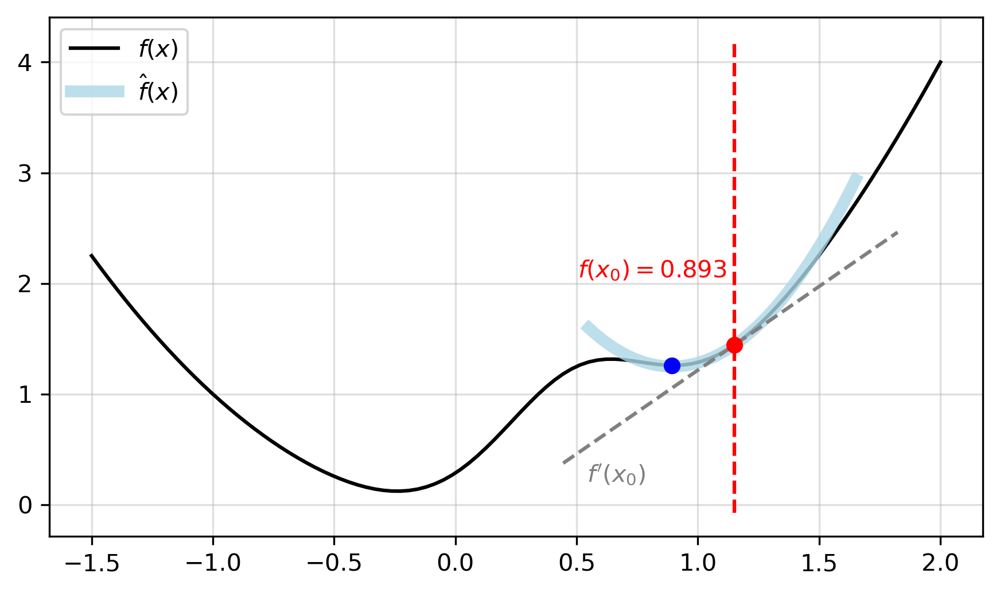
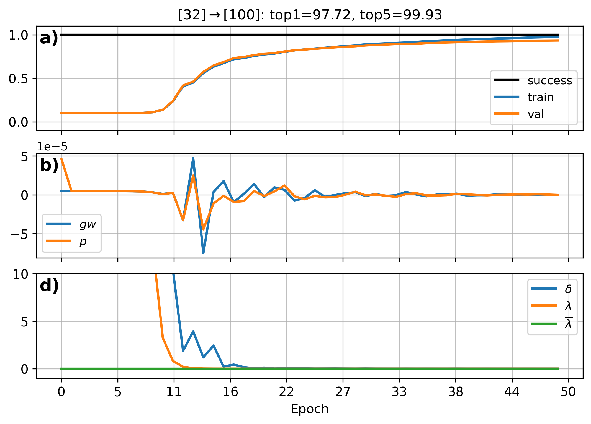
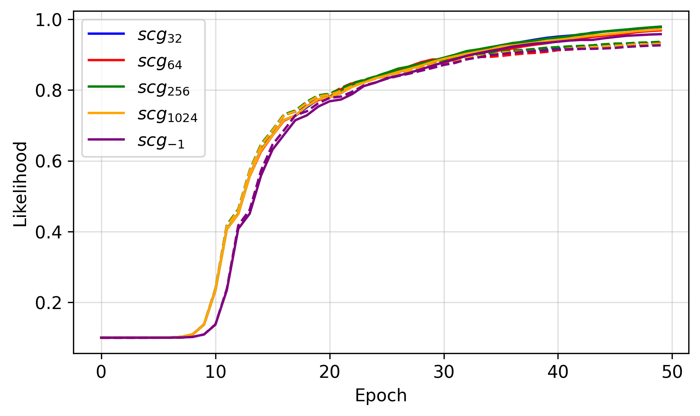

## Minibatched Scaled Conjugate Gradient with Gradient Accumulation
*Sep 23, 2022*  
&nbsp;  
&nbsp;  

Scaled Conjugate Gradient (SCG) is an effective full-batch learning algorithm that uses conjugate search directions and a scalable step size to optimize for a function [(Møller, 1993)](!moller1993). In the regime of first-order methods, we typically employ noisy measurements of the gradient using minibatches of data to minimize a function. This is to improve computational efficiency for large, redundant datasets. Unforunately, the fast convergence properties of conjugate gradients are usually lost in the presence of noisy functions, as maintaining the conjugacy of search directions across multiple iterations becomes unfeasible. However, without infinite compute, we cannot just assume the luxary of full-batch optimization for every dataset.

To address the need to use minibatches, we explore how SCG can be modified using gradient accumulation. This effectively smooths the exact gradients of minibatches over the full dataset, and allows for better use of memory. In the rest of this article, we will dive into the background of SCG, its modified algorithm, and some results with training neural nets.

### Preliminaries

To intuitively motivate SCG, we first detail how to find a scalable step size using a Gauss-Newton approach and then discuss the background of conjugate gradients. Unlike, the majority of first-order optimization methods, e.g., Stochastic Gradient Descent (SGD) and Adaptive Moment Estimation (Adam), we need not rely on specifying a constant step size or learning rate. While momentum or adaptive updates can accelerate these methods, they are really just an ad hoc attempt force the method to use second-order information. But what if we did consider second-order information in our updates?

For some background, the first derivative of an error function with respect to the parameters tell you a search direction in the parameter space that would reduce the function. We could then take a small step by subtracting a constant times the derivative from our current parameter values. However, a step size too small would require many updates and may get stuck in a local minimum or saddle point, whereas a value too large may overstep.

|  | 
|:--:| 
| **Figure 1**: Example function, $f(x) = x^2 + e^{-5(x - .5)^2}$, where $x_0=1.15$. |
&nbsp; 

If we are in the vicinity of a minimum of an error function, we could do what Newton did and approximate the function at the current parameter value with a parabola and solve for the minimum of the parabola. [Figure 1](!taylor) shows an example, starting from an initial point ($\mathrm{\color{red}{red}}$) on our function, then approximating a parabola and finding the minimum ($\mathrm{\color{blue}{blue}}$). In the case where our error function is quadratic in the parameter, then we jump to the true minimum immediately. To fit a parabola to a function at a particular value of $x$, we can derive a way using a truncated Taylor series to approximate the function. This is given by
$$
f(x+\Delta x) \approx \hat{f}(x+\Delta x) = f(x) + f'(x) \Delta x + \frac{1}{2} f''(x) \Delta x^2.
\label{tttt}
$$

To find a value of $\Delta x$ that minimizes $\hat{f}(x+\Delta x)$, we can take its derivative and set it equal to zero as
$$
\begin{align*}
\frac{d \hat{f}(x+\Delta x)}{d\Delta x} &= f'(x) + \frac{1}{2} 2 f''(x)
\Delta x\\
& = f'(x) + f''(x) \Delta x = 0\\
\Delta x &= -\frac{f'(x)}{f''(x)},
\end{align*}
$$
where the last line embeds our parabola approximation. Therefore, we can update our guess for $x$ by adding $\Delta x$ to it. Then iteratively, we can fit a new parabola for $x$, calculate $\Delta x$, and update its value again. This has been for a function $f$ with a single, scalar variable but can extend to a neural network with an unpacked vector of parameters $\mathbf{w}$. The gradient of our function with respect to $\mathbf{w}$ will be a vector of partial derivatives, 
$$
\nabla_{\mathbf{w}} f =
\Big(\frac{\partial f}{\partial w_{1}}, \frac{\partial f}{\partial w_{2}},
\ldots, \frac{\partial f}{\partial w_{n}} \Big).

$$
The second derivatives will be the $n \times n$ Hessian matrix as computed by
$$
\nabla^2_{\mathbf{w}} f =
\begin{pmatrix}
\frac{\partial^2 f}{\partial w_1 \partial w_1} & 
\frac{\partial^2 f}{\partial w_1 \partial w_2} & 
\cdots \;
\frac{\partial^2 f}{\partial w_1 \partial w_n}\\
\frac{\partial^2 f}{\partial w_2 \partial w_1} & 
\frac{\partial^2 f}{\partial w_2 \partial w_2} & 
\cdots \;
\frac{\partial^2 f}{\partial w_2 \partial w_n}\\
\vdots \\
\frac{\partial^2 f}{\partial w_n \partial w_1} & 
\frac{\partial^2 f}{\partial w_n \partial w_2} & 
\cdots \;
\frac{\partial^2 f}{\partial w_n \partial w_n}
\end{pmatrix}
\label{hessian}
$$

It is often impractical to calculate the Hessian explicitly for each update due to the $\mathcal{O}(n^2)$ memory footprint and $\mathcal{O}(n^3)$ computation complexity. Usually, this problem is circumvented by using an approximation of step size found by a line search in optimization. However, SCG avoids the line search with a Levenberg–Marquardt approach (that interpolates between gradient descent and Gauss-Newton methods) in order to *scale* the step size. In doing so, we avoid directly forming the Hessian and can capture second-order information with the Hessian-Vector product. There are also some additional steps to ensure the Hessian is positive definite that will result in a unique global minimum for our function.

|  | 
|:--:| 
| **Figure 2**: Optimizing Rosenbrock, $f(x,y) = (1-x)^2 + 100(y-x^2)^2$. |
&nbsp; 

To understand conjugate gradient methods, let's first consider an error function $E(\mathbf{w})$ that we wish to minimize. Using steepest descent to find an optimal step size will yield two successive steps with gradients that are orthogonal. More formally, computing $\textbf{w}_{t+1} = \textbf{w}_{t} - \eta\nabla E(\textbf{w}_{t})$ such that $\eta$ minimizes $E(\mathbf{w_{t+1}})$ will give successive directions for which $\nabla E(\textbf{w}_{t+1})^{T}\nabla E(\textbf{w}_{t}) = 0$. Intuitively, the search directions of these steps will be orthogonal to each other (up to first-order) and result in a zig-zag pattern, some of which are in the same directions.

Orthogonality can be problematic as subsequent direction may not be in the direction of a minimum unless the error function is quadratic and its contours are circles. Alternatively, if we choose a direction based on the previous ones and on the curvature, or second derivative, then we can converge to a minimum in fewer iterations, as compared to first-order methods optimization. This is because we take into account the non-quadratic nature of the error function and its contours. Effectively, conjugate gradient methods involve selecting search directions that are conjugate, or perpendicular, to all the previous search directions based on the curvature of the error function. 

With SCG, as we do not explicitly define a step size or compute the second derivative, we work with a local, quadratic approximation to the error function and solve for the new value of $\mathbf{w}_{t+1}$ that would minimize the quadratic function. A number of additional steps are taken to improve the quadratic approximation as we will see later. [Figure 2](!rosenbrock) illustrates an example optimization path from SCG as it compares to SGD and Adam with $\eta=0.01$. Note the number of steps needed for each method.

### Our Approach

Gradient accumulation is a technique that allows for updates to occur on batches that would otherwise be too large for what can fit into memory. This is done by sampling a minibatch and accumulating a running sum of the gradients. Resulting in an equivalent sum (ignoring precision errors) as if we used a global batch size. Once we have gone over enough batches, or an entire epoch, we then perform a single optimization step. [Algorithm 1](!alg-gradaccum) shows our new function, $f$, that iterates through the entire dataset, accumulating gradient information along the way.

Writing this out in terms of the SCG results in [Algorithm 2](!alg-scgupdate) with relavant affected lines shown in $\mathrm{\color{red}{red}}$. In fact, there are no major changes that need to happen to the algorithm itself. Most of the work is done with gradient accumulation, allowing us to set any minibatch size. A full description of nomenclature can be found in [Møller, (1993)](!moller1993), although, we use $f_{loss}$ and $f_{grad}$ in place of an error function, $E(\mathbf{w})$, and gradients, $E^\prime (\mathbf{w})$. Note that SCG is broken down to the seven steps written as comments.

### Experiments

All experiments are done in PyTorch, where we can define custom loss functions. Results are shown for classifying handwritten digits from the MNIST dataset. 50,000 samples are used for training and 10,000 are for testing. We train a simple convolutional net with a single convolutional layer of 32 filters, max pooling with a factor of 2, and a fully-connected layer with 100 units all with tanh non-linearities before the linear output layer. 

We start with training on the full dataset and illustrate the results in [Figure 3](!scgparams). Without doing an expansive architecture search we achieve 97.92% top-one accuracy on the test data. Within each panel are the learning curves and some of the parameters tracked by SCG. **a)** summarizes when successful updates are made (we have a good quadratic approximation) and the data likelihood of training and validation. In **b)** are the mean conjugate direction, $p$, and gradient, $gw$, over all network parameters. Lastly, **c)** shows a scalar, $\delta$, computed from the Hessian-Vector product whose sign indicates the positive definiteness of the Hessian, and values of $\lambda$ directly scale the step size (bigger $\lambda$ has a smaller step size). 

We initially see a large $\lambda$ corresponding to a slow change in loss. There is a also a large  change in the magnitude of the conjugate directions during which the loss decreases the fastest. After some time, these values stabilize and training slowly converges to a minima as the step size decreases further.

|  | 
|:--:| 
| **Figure 3**: Parameter trace of SCG. |
&nbsp; 

Using the same hyperparameters and random initializations for all trials, we just change the minibatch size to range between 32 and 1024. A value of -1 means that we do not use minibatches or gradient accumulation, and updates are made over the entire dataset. [Figure 4](!loss) shows this result with the learning curves of each trial, where we see roughly the same decreases in error. Minor differences could be due to precision with slight variations of the loss landscape.

So how do things change when we introduce minibatches? Well, like a loss stuck in a local minima, it doesn't. But this is a good thing! It shows that accumulating gradients with SCG is an effective way to deal with potentially larger datasets and situations where memory is limited, i.e., where full-batch updates are infeasible. 

|  | 
|:--:| 
| **Figure 4**: SCG with varying minibatch sizes for training (-) and validation (--). |
&nbsp; 

### References

[1]$\label{moller1993}$ Møller, M. F. (1993). Efficient training of feed-forward neural networks. *DAIMI Report Series*, (464).